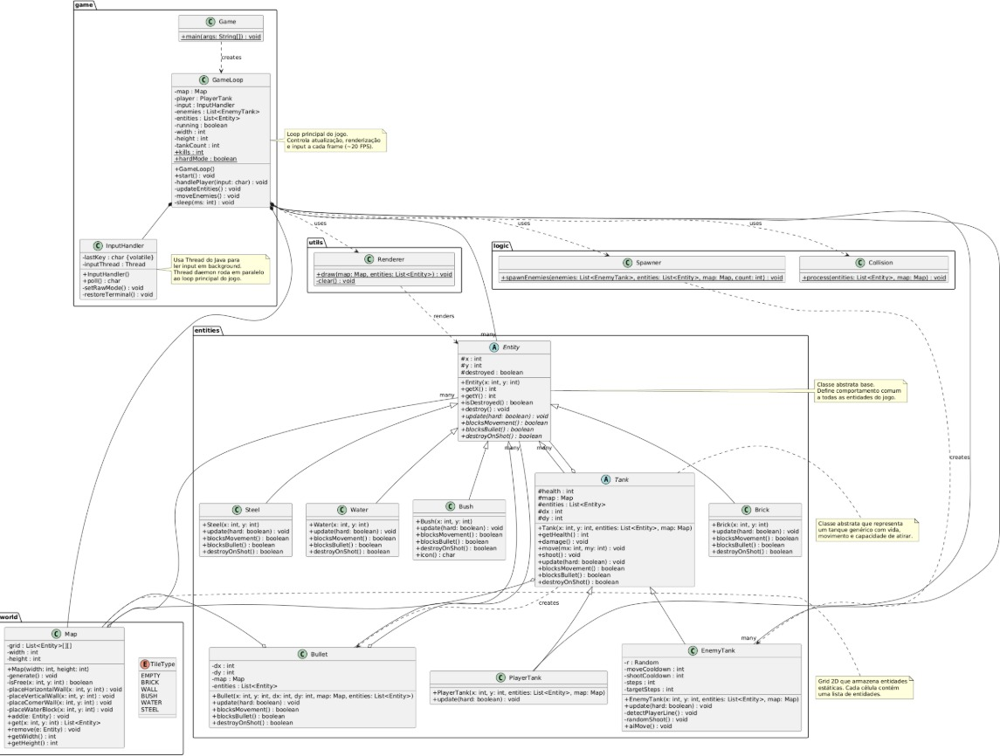

# 🎮 Battle City - Terminal Edition

Um jogo de tanque inspirado no clássico **Battle City**, desenvolvido em Java puro e executado diretamente no terminal com gráficos ASCII.


## 📋 Sobre o Projeto

Este é um jogo de ação onde você controla um tanque (representado por `P`) e precisa destruir os tanques inimigos (representados por `T`) enquanto navega por um campo de batalha com diversos obstáculos.

### Características

- ✅ Jogo completo rodando no terminal
- ✅ Sistema de colisão em duas camadas (mapa estático + entidades móveis)
- ✅ IA dos inimigos com dois modos de dificuldade
- ✅ Diferentes tipos de terreno e obstáculos
- ✅ Sistema de vida para o jogador
- ✅ Geração procedural de mapas
- ✅ Input em tempo real (sem necessidade de pressionar Enter)

## 🎯 Gameplay

```
████████████████████████████████████████████████
█              #                               █
█    T    @         O O                        █
█         @         O O                        █
█                                              █
█  #####                     |||||             █
█  #                         |||||             █
█  #                                           █
█  #                                           █
█  #                              T            █
█                                              █
█         P                                    █
█                                              █
█               @@@                            █
█    O O        @@@                            █
█    O O                         T             █
█                                              █
█                        #####                 █
█              |||||     #   #                 █
████████████████████████████████████████████████
```

### Legenda
- `P` - Seu tanque (Player)
- `T` - Tanques inimigos
- `*` - Balas
- `#` - Parede de tijolo (destrutível)
- `|` - Parede de aço (indestrutível)
- `O` - Água (bloqueia movimento, mas não balas)
- `@` - Arbusto (não bloqueia nada, apenas visual)

## 🕹️ Controles

| Tecla | Ação |
|-------|------|
| `W` | Mover para cima |
| `S` | Mover para baixo |
| `A` | Mover para esquerda |
| `D` | Mover para direita |
| `Espaço` | Atirar |
| `Q` | Sair do jogo |

## 🚀 Como Executar

### Pré-requisitos

- Java 17 ou superior
- Terminal Linux/MacOS ou PowerShell no Windows

> **⚠️ Nota**: O modo raw input funciona melhor em Linux/MacOS. No Windows, pode ser necessário usar WSL ou Git Bash para melhor experiência.

### Compilação e Execução

#### 🐧 Linux / MacOS

```bash
# Clone o repositório
git clone https://github.com/EduardoTBuss/BattleCity
cd BattleCity

# Compile todos os arquivos
javac entities/*.java game/*.java world/*.java logic/*.java utils/*.java

# Execute o jogo
java game.Game
```

**Alternativa com estrutura src/bin:**
```bash
# Compile para pasta bin
javac -d bin $(find . -name "*.java")

# Execute
cd bin
java game.Game
```

#### 🪟 Windows (PowerShell)

```powershell
# Clone o repositório
git clone https://github.com/EduardoTBuss/BattleCity
cd BattleCity

# Compile todos os arquivos
javac entities\*.java
javac game\*.java
javac world\*.java
javac logic\*.java
javac utils\*.java

# Execute o jogo
java game.Game
```

**Ou crie um arquivo `run.bat`:**
```batch
@echo off
echo Compilando o projeto...
javac entities\*.java game\*.java world\*.java logic\*.java utils\*.java

if %errorlevel% == 0 (
    echo.
    echo Compilado com sucesso! Iniciando o jogo...
    echo.
    java game.Game
) else (
    echo.
    echo Erro na compilacao!
    pause
)
```

Depois execute:
```powershell
.\run.bat
```

### Estrutura de Diretórios

```
BattleCity/
│
├── src/
│   ├── entities/
│   │   ├── Entity.java
│   │   ├── Tank.java
│   │   ├── PlayerTank.java
│   │   ├── EnemyTank.java
│   │   ├── Bullet.java
│   │   ├── Brick.java
│   │   ├── Steel.java
│   │   ├── Water.java
│   │   └── Bush.java
│   │
│   ├── game/
│   │   ├── Game.java
│   │   ├── GameLoop.java
│   │   └── InputHandler.java
│   │
│   ├── world/
│   │   ├── Map.java
│   │   └── TileType.java
│   │
│   ├── logic/
│   │   ├── Spawner.java
│   │   └── Collision.java
│   │
│   └── utils/
│       └── Renderer.java
│
├── docs/
│   └── Diagrama_classe_Battle-City.png
│
├── README.md
└── LICENSE
```

## 🏗️ Arquitetura

### Diagrama de Classes Completo



O diagrama acima mostra a arquitetura completa do projeto, incluindo todos os relacionamentos entre as classes, atributos e métodos.

### Hierarquia Simplificada

```
Entity (abstract)
├── Tank (abstract)
│   ├── PlayerTank
│   └── EnemyTank
├── Bullet
├── Brick
├── Steel
├── Water
└── Bush
```

### Principais Componentes

#### 1. **Entity System**
Todas as entidades do jogo herdam da classe abstrata `Entity`, que define:
- Posição (x, y)
- Estado de destruição
- Comportamentos de colisão (blocksMovement, blocksBullet, destroyOnShot)

#### 2. **Game Loop**
O coração do jogo que executa a cada frame (20 FPS):
```java
while (running) {
    Renderer.draw(map, entities);  // Desenha o estado atual
    handlePlayer(input.poll());     // Processa input do jogador
    updateEntities();               // Atualiza todas as entidades
    sleep(50);                      // Mantém 20 FPS
}
```

#### 3. **Sistema de Colisão**
Implementado em duas camadas:
- **Camada 1**: Colisão com mapa estático (paredes, água)
- **Camada 2**: Colisão com entidades móveis (tanques, balas)

#### 4. **IA dos Inimigos**
- **Modo Normal**: Movimento aleatório e tiro ocasional
- **Modo Hard**: Detecta quando o player está na mesma linha/coluna e atira diretamente

Para alternar entre os modos, modifique em `GameLoop.java`:
```java
public static boolean hardMode = true; // true para Hard, false para Normal
```

## 🛠️ Conceitos Implementados

### Programação Orientada a Objetos
- **Herança**: Hierarquia Entity → Tank → PlayerTank/EnemyTank
- **Polimorfismo**: Cada entidade implementa seus próprios comportamentos de colisão
- **Abstração**: Classes abstratas definem contratos para subclasses
- **Encapsulamento**: Atributos protegidos e métodos públicos bem definidos

### Padrões de Projeto
- **Game Loop Pattern**: Loop principal que controla o fluxo do jogo
- **Component Pattern**: Entidades com comportamentos modulares
- **Observer Pattern**: Sistema de eventos através de listas de entidades

### Técnicas Avançadas
- **Multithreading**: Thread separada para captura de input em tempo real
- **Terminal Raw Mode**: Desabilita buffer do terminal para input instantâneo
- **Defensive Copying**: `List.copyOf()` para evitar `ConcurrentModificationException`
- **Procedural Generation**: Geração aleatória de mapas a cada partida

## 🎓 Aprendizados

Este projeto demonstra:
- Manipulação de terminal em Java
- Criação de game loops eficientes
- Sistema de colisão em 2D
- Implementação de IA básica
- Gerenciamento de estado de jogo
- Uso de threads para operações assíncronas

## 🐛 Limitações Conhecidas

- Funciona melhor em terminais Linux/MacOS (modo raw input)
- No Windows, pode ser necessário usar WSL ou Git Bash
- Alguns terminais podem não suportar os caracteres Unicode usados nas bordas

## 🔮 Melhorias Futuras

- [ ] Sistema de pontuação
- [ ] Múltiplos níveis
- [ ] Power-ups (velocidade, escudo, etc.)
- [ ] Sons e efeitos sonoros
- [ ] Menu inicial
- [ ] Suporte nativo para Windows
- [ ] Salvamento de high scores
- [ ] Modo multiplayer local

## 📝 Licença

Este projeto está sob a licença MIT. Veja o arquivo [LICENSE](LICENSE) para mais detalhes.

---

**MIT License** - Você é livre para usar, modificar e distribuir este código, desde que mantenha os créditos originais.

## 👨‍💻 Autor

Desenvolvido como projeto acadêmico para demonstração de conceitos de Programação Orientada a Objetos.

---

⭐ Se você gostou deste projeto, considere dar uma estrela no repositório!
